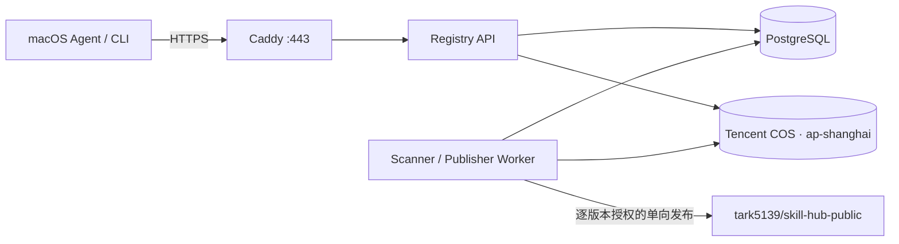

# 腾讯云上海个人 MVP 部署与 GitHub 公开发布

本文档描述首版的人工部署基线，不会自动创建腾讯云资源或 GitHub 仓库。该基线以低成本验证为目标，接受单机故障和维护窗口，不应直接视为团队生产高可用方案。

## 1. 边界与拓扑

- 地域固定为腾讯云上海 `ap-shanghai`。
- 一台 Linux Lighthouse/CVM 运行 API、Worker、PostgreSQL 和可选 Caddy。
- 两个上海 COS 私有桶分别保存隔离区对象和已发布的内部不可变对象。
- GitHub 只接收经逐版本明确授权的公开派生包，不是事实源，也没有反向同步路径。
- PostgreSQL 不映射宿主机端口；API 默认只绑定 `127.0.0.1:8080`。



建议从 2 核 4 GB 起步；如果扫描大压缩包时出现内存压力，优先升至 4 核 8 GB，而不是降低解压限制。个人 MVP 的主要风险是数据库与应用同机，目标可暂定为每日备份、RPO 24 小时、RTO 2 小时。

## 2. 人工准备清单

1. 在上海地域准备一台安装了 Docker Engine 与 Compose v2 的 Linux 实例。
2. 准备已完成 ICP 备案的 API 域名，将 A/AAAA 记录指向实例公网地址。
3. 在 `ap-shanghai` 创建两个**私有** COS 桶，名称必须包含腾讯云 APPID：
   - 隔离桶，例如 `skill-hub-quarantine-1250000000`；
   - 发布桶，例如 `skill-hub-release-1250000000`。
4. 为发布桶启用版本控制和服务端加密；拒绝公共读，下载由 API 生成短时签名地址。隔离桶可设置扫描完成或失败后的生命周期清理规则。
5. 创建只允许访问上述两个桶的 CAM 凭据。隔离桶写入权限与发布桶提升权限应尽可能分离；MVP 若暂用一组凭据，也不得授予账号级管理权限。
6. 预创建公开仓库 `tark5139/skill-hub-public`，并在第一次发布前启用 GitHub Release
   immutability。GitHub CLI 可直接调用官方 REST API：

   ```sh
   gh api --method PUT -H "X-GitHub-Api-Version: 2026-03-10" \
     repos/tark5139/skill-hub-public/immutable-releases
   gh api -H "X-GitHub-Api-Version: 2026-03-10" \
     repos/tark5139/skill-hub-public/immutable-releases
   ```

   第二条命令必须返回 `enabled: true`。该策略只锁定启用后发布的 Release；历史 Release 不会
   自动变为不可变。
7. 为发布自动化安装仅可访问该仓库的 GitHub App，仓库权限只授予 `Contents: write`。运行时注入短时 installation token；不要把 App 私钥或长期 PAT 写入 `.env`、镜像或数据库。

## 3. 安全组与主机

入站建议：

| 端口 | 来源 | 用途 |
|---|---|---|
| 22/TCP | 固定管理 IP 或 VPN 网段 | 运维 SSH；不允许全网开放 |
| 80/TCP | `0.0.0.0/0`、`::/0` | Caddy ACME 与 HTTPS 跳转 |
| 443/TCP、443/UDP | `0.0.0.0/0`、`::/0` | HTTPS / HTTP/3 |

不要在安全组开放 5432、8080 或任何 COS 凭据管理端口。出站至少允许 DNS、NTP 和 HTTPS；GitHub API、GitHub 上传域名及 COS 上海端点均需要 443/TCP。主机应开启自动安全更新、时间同步和磁盘容量告警。

## 4. 配置与启动

从仓库根目录准备 `.env`，文件权限设为 `0600`。下面只列生产必需差异，所有值均应替换：

```dotenv
POSTGRES_DB=skillhub
POSTGRES_USER=skillhub
POSTGRES_PASSWORD=<random-database-password>
SKILLHUB_DATABASE_URL=postgresql+psycopg://skillhub:<url-encoded-password>@postgres:5432/skillhub

SKILLHUB_ENV=production
SKILLHUB_ADMIN_TOKEN=<at-least-32-random-characters>
SKILLHUB_PUBLIC_BASE_URL=https://skills.example.cn

SKILLHUB_STORAGE_BACKEND=s3
SKILLHUB_S3_ENDPOINT_URL=https://cos.ap-shanghai.myqcloud.com
SKILLHUB_S3_REGION=ap-shanghai
SKILLHUB_S3_QUARANTINE_BUCKET=skill-hub-quarantine-1250000000
SKILLHUB_S3_RELEASE_BUCKET=skill-hub-release-1250000000
SKILLHUB_S3_ACCESS_KEY_ID=<least-privilege-cam-key>
SKILLHUB_S3_SECRET_ACCESS_KEY=<least-privilege-cam-secret>
SKILLHUB_REQUIRE_SIGNATURE=true
SKILLHUB_TRUSTED_PUBLIC_KEYS_JSON={"tark5139:release-1":"base64:<32-byte-public-key-base64>"}

SKILLHUB_GITHUB_OWNER=tark5139
SKILLHUB_GITHUB_REPOSITORY=skill-hub-public
SKILLHUB_GITHUB_APPROVER=tark5139
SKILLHUB_GITHUB_TOKEN=<short-lived-github-app-installation-token>

SKILLHUB_DOMAIN=skills.example.cn
```

校验并启动内部服务：

```sh
chmod 600 .env
docker compose config --quiet
docker compose up -d --build
docker compose ps
docker compose logs migrate
curl -fsS http://127.0.0.1:8080/health/ready
```

启用 Caddy 自动 HTTPS：

```sh
docker compose --profile https up -d caddy
curl -fsS https://skills.example.cn/health/ready
```

Caddy 需要公网 80/443、正确 DNS 和已备案域名。确认 HTTPS 正常后，应继续保持 API 的宿主机映射仅监听回环地址。不要通过 COS 自定义域名公开内部技能包。

## 5. COS 与发布安全

- 隔离对象只能由上传/扫描流程读取；扫描通过后复制到内容寻址的 release key，禁止原地改写。
- 应用使用条件写入拒绝覆盖；发布桶还必须启用 COS 版本控制/对象锁作为独立兜底。
- COS 发布桶保存内部事实包；GitHub Release 保存经过公开审批、脱敏和重新扫描后的派生包。
- GitHub 发布授权必须同时绑定 Skill 名称、精确版本、包 SHA-256、目标 owner/repository、审批人和审批记录 ID。
- tag 固定为 `<skill>-v<semver>`。发布器会同时检查 tag 与 Release 均不存在；任何一项存在即拒绝覆盖。
- 发布顺序固定为：创建 Draft Release、上传 ZIP、manifest、checksums、`signature.sig.json`、
  完整 LICENSE、README 和 attestation，回读并核对名称、大小与摘要，最后发布。
- 上传或校验失败会保留 Draft 供人工调查；系统不会自动删除、覆盖或从 GitHub 回灌数据。
- GitHub 公开发布在现实上不可撤回。发现问题时在 Hub 标记撤销、停止推荐旧版并发布新版本；不能把“删除远端”当作召回机制。

## 6. PostgreSQL 备份与恢复

创建本地自校验备份：

```sh
./ops/scripts/backup_postgres.sh
```

默认保留 14 天。可通过 `RETENTION_DAYS` 调整。若宿主机已安装并配置兼容 S3 的 AWS CLI，可把备份复制到一个独立、私有且开启服务端加密的 COS 备份桶：

```sh
BACKUP_COS_URI=s3://skill-hub-backup-1250000000/postgres \
BACKUP_COS_ACCESS_KEY_ID=<backup-only-cam-key> \
BACKUP_COS_SECRET_ACCESS_KEY=<backup-only-cam-secret> \
SKILLHUB_S3_ENDPOINT_URL=https://cos.ap-shanghai.myqcloud.com \
./ops/scripts/backup_postgres.sh
```

备份桶应使用不同于应用运行凭据的写入身份，并设置保留/版本控制策略。至少每月执行一次恢复演练。恢复会停止 API 与 Worker，并对目标数据库执行清理恢复：

```sh
CONFIRM_RESTORE=skillhub ./ops/scripts/restore_postgres.sh \
  ./ops/backups/skillhub-YYYYMMDDTHHMMSSZ.dump
```

恢复前先创建云盘快照并记录当前 COS release key 水位；恢复后执行 `docker compose run --rm migrate`，检查 `/health/ready`、随机三个 manifest 和对应 COS SHA-256，再开放服务。

## 7. 深圳与广州 P95 探针

脚本必须分别在物理位于深圳和广州的独立探针机运行；修改 `--location` 标签并不能改变网络路径。每个地点至少 30 个有效样本，推荐连续三个时段均无失败且 P95 不高于 250 ms：

```sh
python3 ops/scripts/p95_probe.py \
  --location shenzhen \
  --url https://skills.example.cn/health/ready \
  --samples 30 \
  --p95-threshold-ms 250

python3 ops/scripts/p95_probe.py \
  --location guangzhou \
  --url https://skills.example.cn/health/ready \
  --samples 30 \
  --p95-threshold-ms 250
```

脚本输出单行 JSON，退出码 `0` 表示无失败且满足阈值，`1` 表示超阈值或有部分失败，`2` 表示全部失败。结果应连同时间、运营商和探针公网 IP 保存，不能仅保留一次最好成绩。

## 8. 上线与退出条件

上线前必须满足：

- COS 两桶均为私有，测试账号无法列出其他桶；
- 5432/8080 未对公网开放，HTTPS 证书和 HSTS 正常；
- `.env`、GitHub App 私钥和 CAM 密钥未进入镜像、Git 历史或日志；
- PostgreSQL 备份生成、校验、异机恢复演练通过；
- 深圳与广州探针均满足约定阈值；
- GitHub 仓库已开启 Release immutability，并用测试版本验证“既有 tag/Release 拒绝覆盖”；
- Alembic migration job 成功完成，API 与 Worker 均不在生产启动时执行 `create_all`；
- Worker 心跳进入 `/health/ready`，停掉 Worker 后探针能在超时窗口内转为失败；
- 生产配置缺失可信 Ed25519 公钥或关闭签名时，应用必须拒绝启动；
- 每一个公开版本均可追溯到 Hub 内唯一审批记录和相同 artifact SHA-256。

当持续负载、恢复目标或协作人数超过个人 MVP 边界时，应迁移到独立托管 PostgreSQL、至少两个 API 副本和独立任务队列，而不是在单机 Compose 上叠加隐性高可用承诺。
